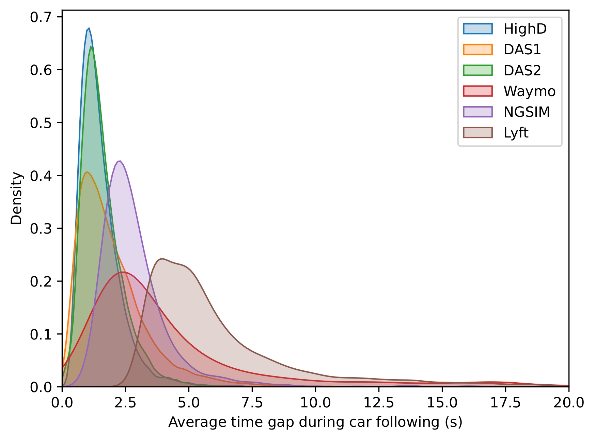
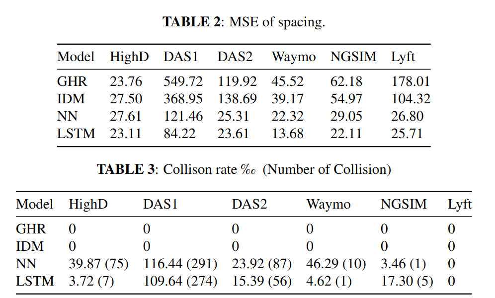
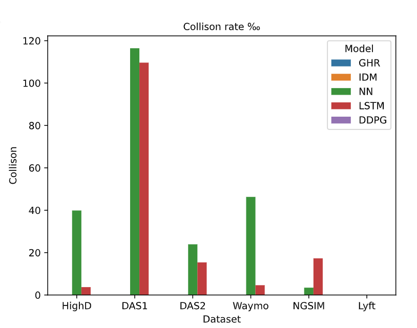
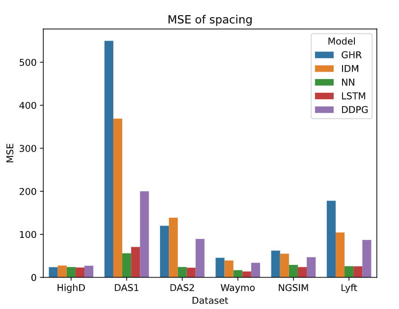

# FollowNet: A Comprehensive Benchmark for Car-Following Behavior Modeling
Source code for the following paper:

Chen, Xianda, et al. "FollowNet: A Comprehensive Benchmark for Car-Following Behavior Modeling." 


## 📝Description
This notebook demonstrates how to achieve the car following models from traditonal models to data driven models. Motivation: given extracted car following events from five open datasets with the same data formate and train the car follow models. Author: Chen Xianda.

   The extracted car following events are avaliable for download.
Provide a tutorial of the data format and how to run the traditional models and the data-driven models.

## 🚕  Data
Extracted car-following events are stored in `data/` folder. The colab tutorial takes the highD data for experiments first. 
     
   The datasets are HighD, SPMD(DAS1, DAS2), Waymo, Lyft, NGSIM. Each has its own training, validation and test part.

## 🛠 Quick Start 
Run the colab notebook directly! Details are in the notebook below. 

   [](https://colab.research.google.com/drive/1jB-eM9A1N1q5mPv3TjZPx6drezvURtqD?usp=share_link) 

## 📚 Pretrained Models
Pretrained models are stored in `trained_model/` folder. 


## 📈 Dataset distribution
Below is the average time gap during car following (s). For more results stored in `results/` folder.



## 📊 Evaluation Metrics


Collsion rate 



 MSE of spacing
 


## 📭Contact
meixin@ust.hk

  xchen595@connect.hkust-gz.edu.cn

## 📎 References

If you use extracted car following data / FollowNet in your own work, please cite:

```latex
@article{****}
}
```

